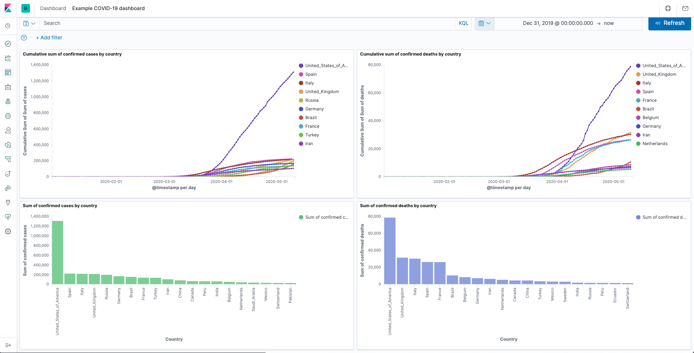

# Elasticsearch Tutorial

Example of a dashboard created with this tutorial (11.5.2020):



## Requirements

* Docker
* docker-compose
* Make sure Docker Engine is allotted at least 4GiB of memory. In Docker Desktop, you configure resource usage on the Advanced tab in Preference (macOS) or Settings (Windows).

### Recommended

* Visual Studio Code
* Docker extension for VS Code

## Getting started

To get started open up a terminal window to the root of this folder. Run:
> NOTE: This might take a several of minutes, be patient

```sh
docker-compose up
```

This will launch an Elasticsearch cluster with three Elasticsearch instances and on Kibana instances running inside separate docker containers. You only need one instance of Elasticsearch but this tutorial will demonstrate simple scalability.

To shut down the cluster, run:

```sh
docker-compose down
```

You can use the docker extension for VS code to check that all of the containers are stopped.

When you want to remove the containers, images, persistent volumes and networks, run:
> NOTE! This will remove ALL containers, images, persistent volumes and networks on your system!

```sh
docker system prune -a
```

### Import data

In this tutorial we will import the data into Elasticsearch the easiest way. By Going to the home screen of Kibana (Clicking on the K Logo in the top left corner) you will find a link with the text: `Import a CSV, NDJSON, or log file`, Click it. Drag and drop the `.csv` file from the `./Data` folder to Kibana. Inspect the data and click the blue `Import` button in the bottom left corner. Give the index the name: `covid-19-geographic-distribution-worldwide`
> NOTE! Uppercase letters are not allowed

#### COVID-19-geographical-distribution dataset

source: [https://data.europa.eu/euodp/en/data/dataset/covid-19-coronavirus-data/resource/260bbbde-2316-40eb-aec3-7cd7bfc2f590](https://data.europa.eu/euodp/en/data/dataset/covid-19-coronavirus-data/resource/260bbbde-2316-40eb-aec3-7cd7bfc2f590)

### Queries

Here are som example queries that you can test on the imported data. The simplest way to familiarize with the query DSL (Domain Specific Language) syntax is to open up the **Dev Tools** in Kibana (The wrench icon on the left side).

Additional resources: [https://www.elastic.co/guide/en/elasticsearch/reference/current/query-dsl.html](https://www.elastic.co/guide/en/elasticsearch/reference/current/query-dsl.html)

Return all matching documents with the field `countriesAndTerritories=Finland`

```json
GET covid-19-geographic-distribution-worldwide/_search
{
  "query": {
    "query_string" : {
            "query" : "Finland",
            "default_field" : "countriesAndTerritories"
        }
  }
}
```


## Additional resources

[Query DSL](https://www.elastic.co/guide/en/elasticsearch/reference/current/query-dsl.html)

[Running the Elastic Stack on Docker](https://www.elastic.co/guide/en/elastic-stack-get-started/current/get-started-docker.html#CO2-1)
